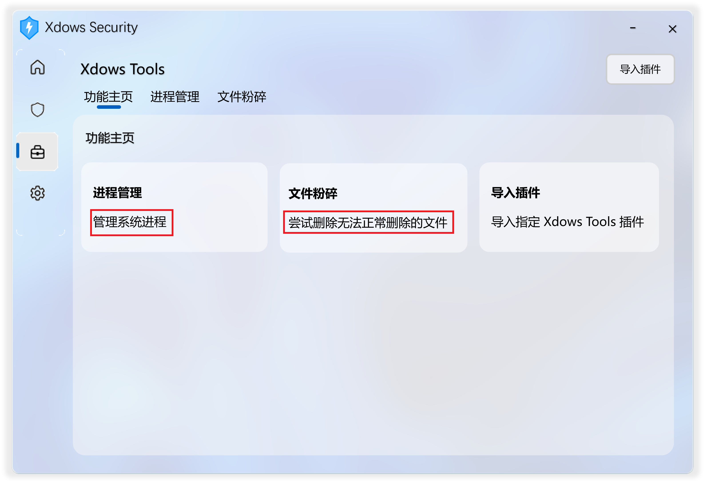

# Main.dll

## 简介

Main.dll 为 Xdows Tools 实际调用的DLL

Xdows Tools 通过调用这个DLL来实现插件功能

Main.dll 通常是在 插件名\Files\Main.dll 文件

## 注意

在编译DLL时尽量选择目标 Xdows Security 的架构（一般为 x86 架构）

不同的架构可能会导致运行**效率慢**或**崩溃**问题

## 使用
> [!IMPORTANT]
> 以下DLL程序中的必须存在
> 
> 如果不存在，程序将会崩溃


### SetUIHtml

|    名称   |  返回类型 |注明                                    |
| :-------- | :------- | :-------------------------------------- |
| SetUIHtml |   Text   |该函数定义在 Xdows Tools 中载入的 Html 文件|

该函数没有参数，如有参数则程序崩溃

::: code-group

```cpp[C++]
// 由 DeepSeek 翻译，可能需要进行修改

#include <string>
#include <fstream>
#include <filesystem>

std::string SetUIHtml() {
    // 请把 "Name" 替换为插件名，把 "HtmlFiles" 替换为需要显示的 Html 文件名
    using namespace std::filesystem;
    auto path = current_path() / "Plugins\\Name\\Files\\HtmlFiles.html";
    return std::string(std::istreambuf_iterator<char>(std::ifstream(path).rdbuf()),
                        std::istreambuf_iterator<char>() );
}
```

```c[C]
// 由 DeepSeek 翻译，可能需要进行修改

#include <windows.h>
#include <stdio.h>

char* SetUIHtml() {
    // 请把 "Name" 替换为插件名，把 "HtmlFiles" 替换为需要显示的 Html 文件名
    char path[MAX_PATH];
    sprintf(path, "%s\\Plugins\\Name\\Files\\HtmlFiles.html", 
            GetModuleHandle(NULL) ? "" : ""); // 获取当前目录的巧妙方式
    
    HANDLE hFile = CreateFileA(path, GENERIC_READ, FILE_SHARE_READ, NULL,
                              OPEN_EXISTING, FILE_ATTRIBUTE_NORMAL, NULL);
    if (hFile == INVALID_HANDLE_VALUE) return NULL;

    DWORD size = GetFileSize(hFile, NULL);
    char* buf = (char*)malloc(size + 1);
    ReadFile(hFile, buf, size, &size, NULL);
    buf[size] = 0;
    CloseHandle(hFile);
    return buf;
}

/* 使用后需 free() 释放内存 */
```

```py[Python]
# 由 DeepSeek 翻译，可能需要进行修改

import os

def set_ui_html() -> str:
    # 请把 "Name" 替换为插件名，把 "HtmlFiles" 替换为需要显示的 Html 文件名，把 “utf-8” 替换为文件编码
    file_path = os.path.join(os.getcwd(), "Plugins", "Name", "Files", "HtmlFiles.html")
    with open(file_path, 'r', encoding='utf-8') as f:
        return f.read()
```

```EPL[易语言]
.版本 2

.子程序 SetUIHtml, 文本型, 公开

‘ 请把 “Name” 替换为插件名，把 “HtmlFiles” 替换为需要显示的 Html 文件名
返回 (到文本 (读入文件 (取运行目录 () ＋ “\Plugins\Name\Files\HtmlFiles.html”)))
```
:::


### SetUITitle


（示例：图中红框部分即为该DLL返回的内容显示效果）

|    名称    |  返回类型 |注明                               |
| :--------- | :-------- | :-------------------------------- |
| SetUITitle |    Text   |该函数定义在 Xdows Tools 中显示的标题|

该函数没有参数

::: code-group

```c[C++/C]
// 由 DeepSeek 翻译，可能需要进行修改

const char* SetUITitle() {
 return "PluginsTitle";
}

```

```py[Python]
# 由 DeepSeek 翻译，可能需要进行修改

def SetUITitle():
 return "PluginsTitle"

```

```EPL[易语言]
.版本 2

.子程序 SetUITitle, 文本型, 公开

返回 (“PluginsTitle”)

```

:::

### GetInfo



（示例：图中红框部分即为该DLL返回的内容显示效果）

|    名称   |  返回类型 |注明                                                    |
| :-------- | :------- | :------------------------------------------------------ |
| GetInfo   |    Text  |该函数定义在 Xdows Tools 功能主页 显示的简介|

该函数没有参数，如有参数则程序崩溃

::: code-group

```c[C++/C]
// 由 DeepSeek 翻译，可能需要进行修改

const char* GetInfo() {
 return "PluginsInfo";
}

```

```py[Python]
# 由 DeepSeek 翻译，可能需要进行修改

def GetInfo():
 return "PluginsInfo"

```

```EPL[易语言]
.版本 2

.子程序 GetInfo, 文本型, 公开

返回 (“PluginsInfo”)

```
:::

### ScanFiles

|    名称    |  返回类型 |注明                               |
| :--------- | :-------- | :-------------------------------- |
| ScanFiles  |    Text   |该函数用于在扫描文件时插件添加的额外引擎|

如果未检测到病毒或选择忽略此功能请返回空文本

如果检测到病毒请返回病毒名称

该函数的参数如下

| 名称 |  类型 |注明|
| :--- | :--- | :----------------------------------- |
| Path | Text |预扫描的文件名称。不可空，无需处理相关问题|

### Html文件内调用

你可以使用 Http 访问来调用DLL

``` js
const Http = new XMLHttpRequest();
Http.open("GET", '/Function/插件名-调用函数/?参数1=参数内容&参数2=参数内容',false);
Http.send();

```

> [!IMPORTANT]
> 参数最多只能有 2 个
>
> 多余参数将会被忽略
> 
> 调用的DLL函数返回值必须为 Text 型（不需要可返回空文本），参数必须为 Text 型
>
> 其它类型将会崩溃


