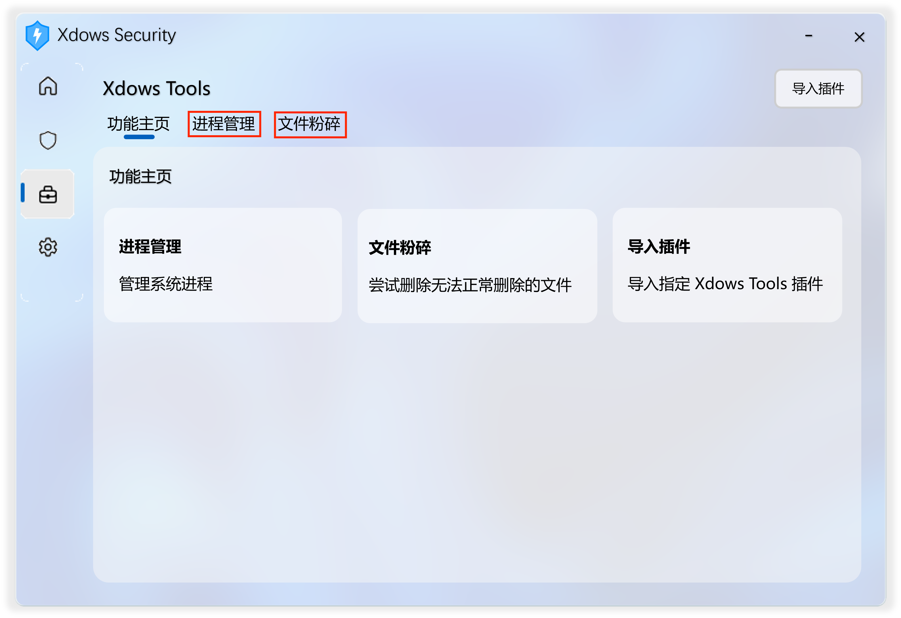

# Main.dll

## 简介

Main.dll 为 Xdows Tools 实际调用的DLL

Xdows Tools 通过调用这个DLL来实现插件功能

Main.dll 的文件名和位置均可自定义

你可以在[这个文件](./Plugins.ini.md#%E4%BD%BF%E7%94%A8)中的 `Dll`-`DllData` 来自定义

## 注意

在编译DLL时尽量选择目标 Xdows Security 的架构（一般为 x86 架构）

不同的架构可能会导致运行**效率慢**或**崩溃**问题

## 使用
> [!IMPORTANT]
> 以下DLL程序中的必须存在
> 
> 如果不存在，程序将会崩溃

### SetUIHtml

|    名称   |  返回类型 |注明                                    |
| :-------- | :------- | :-------------------------------------- |
| SetUIHtml |   Text   |该函数定义在 Xdows Tools 中载入的 Html 文件|

只有在 [这个文件](./Plugins.ini.md#%E4%BD%BF%E7%94%A8)中的 `Tab`-`UseTab` 的值为1时才成立

忽略（返回空文本）将会使用 [这个文件](./Plugins.ini.md#%E4%BD%BF%E7%94%A8)中的 `Tab`-`TabData` 来代替

该函数没有参数，如有参数则程序崩溃

### SetUITitle

（示例：图中红框部分即为该DLL返回的内容显示效果）

|    名称    |  返回类型 |注明                               |
| :--------- | :-------- | :-------------------------------- |
| SetUITitle |    Text   |该函数定义在 Xdows Tools 中显示的标题|

只有在 [这个文件](./Plugins.ini.md#%E4%BD%BF%E7%94%A8)中的 `Tab`-`UseTab` 的值为1时才成立

忽略（返回空文本）将会使用 [这个文件](./Plugins.ini.md#%E4%BD%BF%E7%94%A8)中的 `Tab`-`TabName` 来代替

该函数没有参数

### ScanFiles

|    名称    |  返回类型 |注明                               |
| :--------- | :-------- | :-------------------------------- |
| ScanFiles  |    Text   |该函数用于在扫描文件时插件添加的额外引擎|

如果未检测到病毒或选择忽略此功能请返回空文本

如果检测到病毒请返回病毒名称

该函数的参数如下

| 名称 |  类型 |注明|
| :--- | :--- | :----------------------------------- |
| Path | Text |预扫描的文件名称。不可空，无需处理相关问题|

