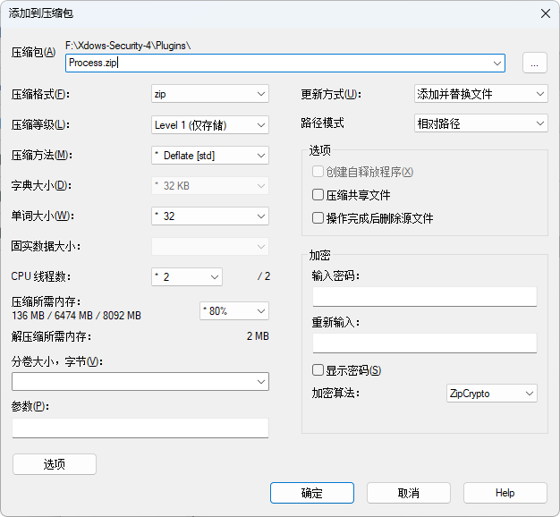
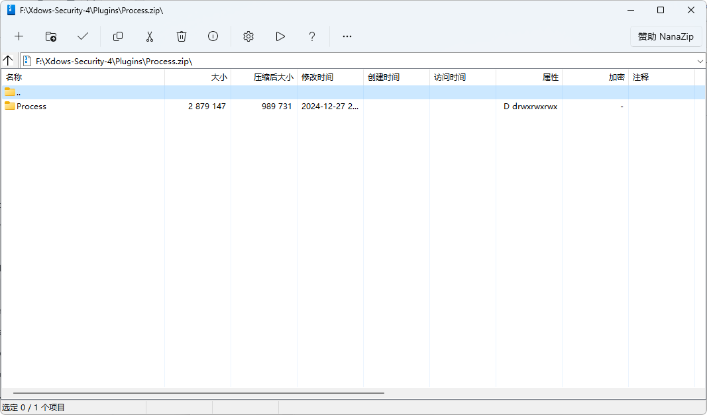

# 制作插件包

## 压缩软件

理论上可以使用基本所有支持压缩 ZIP 的软件。

但是推荐使用开源软件 `7-Zip`，因为它具有高效的压缩算法和广泛的兼容性。

本文章使用基于 `7-Zip` 的软件 `NanaZip`。

其它软件可能显示界面有所不同，但操作步骤大致相同。

## 准备插件内容

在开始压缩之前，请确保插件目录的结构正确。一个标准的插件目录结构如下：

```
PluginName/
├── Data/
│   └── ...
└── Files/
    ├── Main.dll
    └── ...
```

请确保 `Main.dll` 文件位于 `Files` 文件夹中，并且所有必要的数据文件都存放在 `Data` 文件夹中。

## 压缩插件目录

1. 在插件目录上右键，选择 `添加到压缩包`。

2. 在弹出的窗口中选择以下选项：

   - 压缩格式：zip
   - 压缩等级：Level 1（快速压缩，适合插件包）

   

3. 确认选项后，点击 `确定` 开始压缩。

## 验证压缩结果

压缩完成后，检查生成的 ZIP 文件是否符合以下目录结构：

```
Plugin.zip
├── PluginName/
│   ├── Data/
│   │   └── ...
│   └── Files/
│       ├── Main.dll
│       └── ...
```

可以通过解压缩文件并检查内容来验证。

## 多插件插件包

直接选择多个插件一起压缩即可，完成后像这样：

```
Plugin.zip
├── PluginName1/
│   ├── Data/
│   │   └── ...
│   └── Files/
│       ├── Main.dll
│       └── ...
├── PluginName2/
│   ├── Data/
│   │   └── ...
│   └── Files/
│       ├── Main.dll
│       └── ...
└── ...
```

## 示例

以下是一个以 Process 插件为例的压缩包内容截图：



## 常见问题

1. 压缩后文件结构不正确
   - 请检查插件目录的初始结构是否符合要求。
   - 确保在压缩时选择了正确的选项。

2. 压缩包无法被识别
   - 确保使用的是 ZIP 格式。

3. 压缩等级选择问题
   - Level 1 是推荐的压缩等级，既能保证速度又能提供足够的压缩率。

4. 如何导入插件包
   - 在 `Xdows Tools` - `导入插件` 选择插件包导入即可。