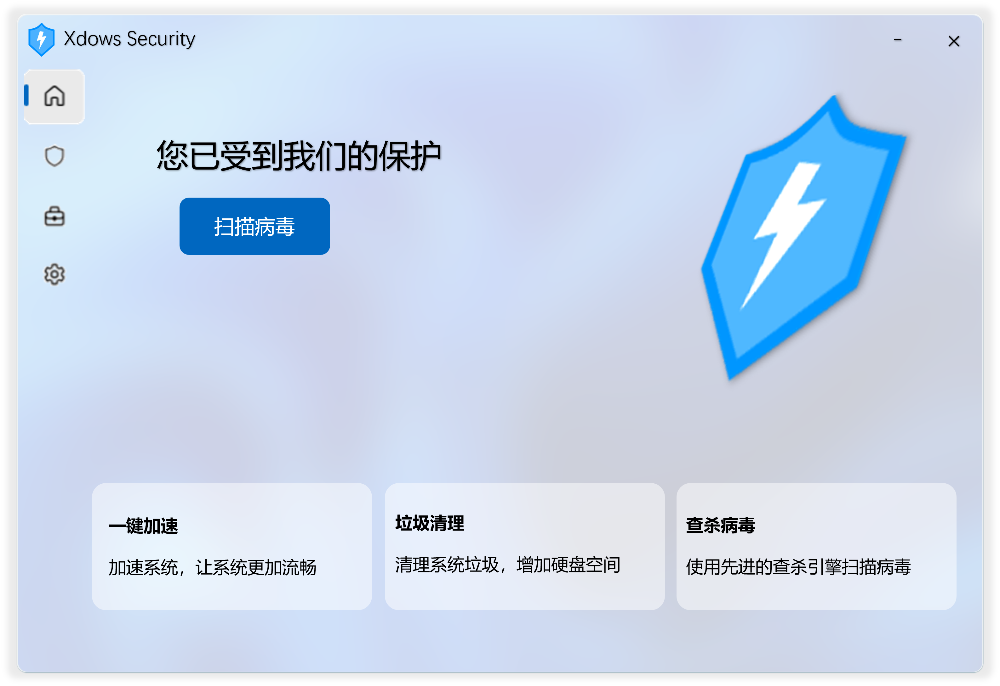
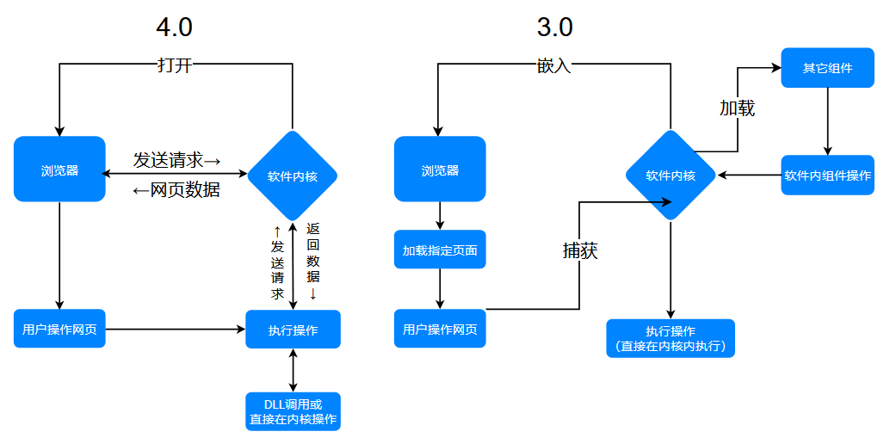

# 快速开始

（图片仅供参考）

来看看下一代的全新 Xdows Security 4.0

## 简介

Xdows Security 是旨在防御潜在威胁与检测病毒威胁的杀毒软件。

## 下载

你现在可以下载测试版

请先看 `README.txt` 再安装

测试版仅供测试，后果自负

<Linkcard url="/Setup.zip" title="下载 Xdows Security Beta" description="仅用于测试" logo="/logo.svg"/>

## 进度

 - [x] 项目建立
 - [x] 杀毒引擎
 - [ ] 制作 UI
 - [ ] 连接 UI 和功能
 - [ ] 发布内测版
 - [ ] 发布公测版
 - [ ] 发布正式版

## 内核

Xdows Security 的 3.0 和 4.0 都基于 Web 技术构建

从中可以看到：

 - 3.0 版本只是让浏览器加载网页然后内核捕获网页的 js 操作达到目的，并且除了 WebUI 仍然有其它组件，这些组件不可自定义

 - 4.0 版本是真正的可以和浏览器互相发送数据，并且只有 WebUI，大大提高了可自定义性，同时UI还有一定的跨平台性
