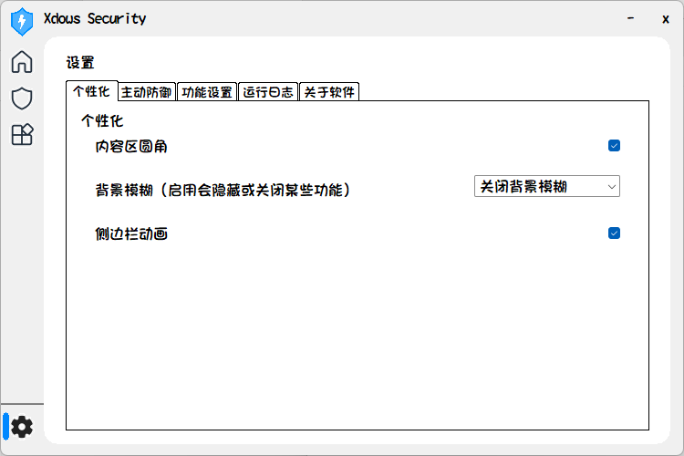
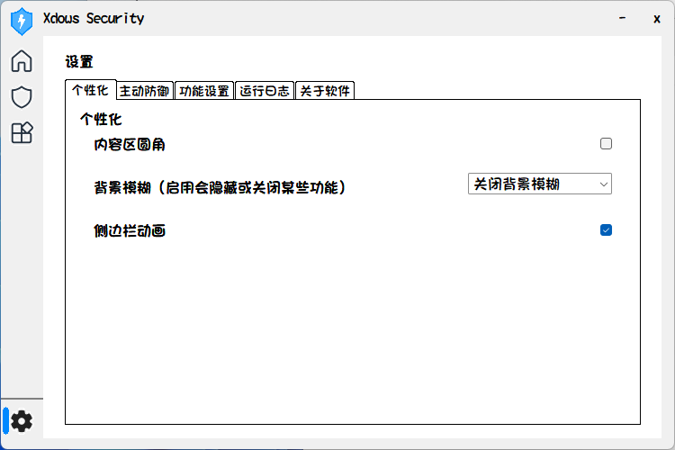
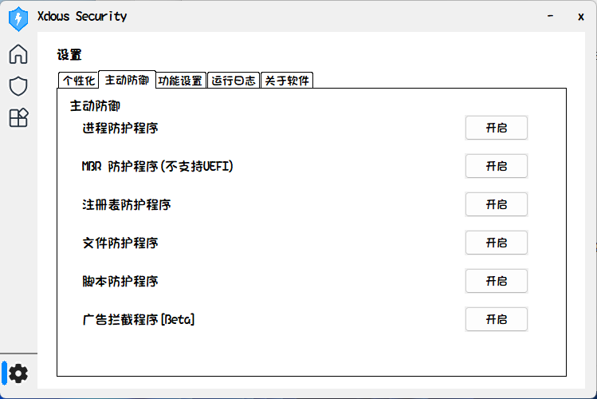
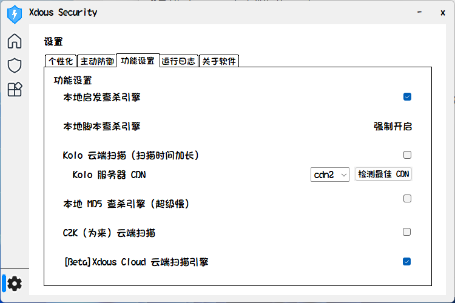

# 设置功能

## 个性化

个性化可以对 Xdows Security 的 UI 进行设置。



### 基础

内容区圆角是默认开启的

关闭的样子如图所示


（观察内容区的四角）

背景模糊**只支持** Windows 11 系统，启用会隐藏窗口标题和关闭侧边栏动画

侧边栏动画是控制侧边栏蓝色条的动画

### 高级

Xdows Security UI 是基于 Html 技术构建的，所以你可以编辑相关文件来达到修改 UI 的效果。具体路径如下：

::: tabs

@tab 主页 Html
```ts
Install\Bin\Home
```
@tab 杀毒 Html
```ts
Install\Bin\Security
```
@tab Xdows Tools Html
```ts
Install\Bin\Xdows Tools
```
:::

::: warning
设置**不支持**定制，因为它不基于 Html
:::

::: tip
如果你运行着 Xdows Security Pro 并且想要更深度的定制，请联系作者 QQ：2966643247

具体内容请查看[这里][Pro]
:::

## 主动防御

这里用于开启 Xdows Security 的服务



## 功能设置

这里列出了 Xdows Security 支持的所有扫描引擎，你可以自由开关。



::: tip
Kolo 引擎**暂时无法使用**。
:::

::: tip
如果你运行着 Xdows Security Pro 会有额外防护，具体内容请查看[这里][Pro]
:::

## 运行日志

如果 Xdows Security 崩溃了，这些日志可能对我们有帮助，你可以在 QQ 群反馈并带上日志文件，路径如下：

```ts
Install\Log\Run.txt
```
## 关于软件

记录了组件作者、鸣谢列表等数据

点击右上方 *反馈* 按钮以反馈问题

::: tip
在这感谢所有贡献了开源代码的开发者！
:::

[Pro]:/Xdows-Security/pro-version.html#区别
