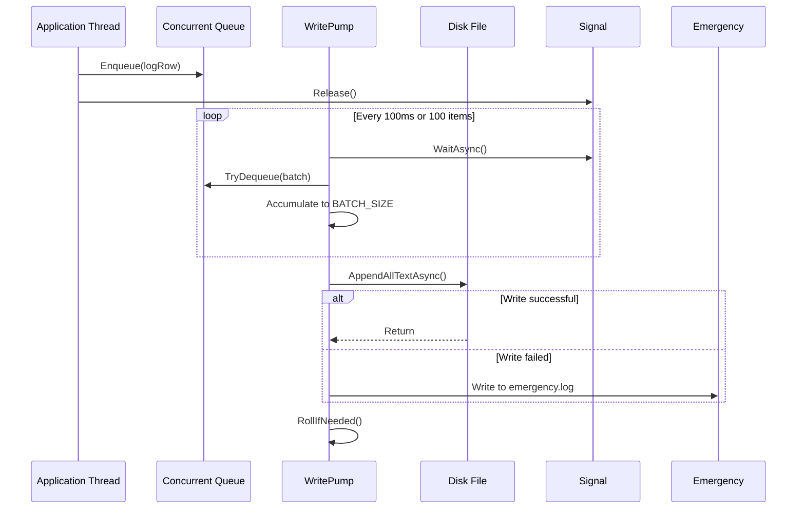

# Log System {#log-system}

This document describes the logging system in Xdows Security (for developers)

## Overview {#overview}

Xdows Security's logging system is an asynchronous logging framework designed for high-performance desktop applications, featuring a **dual-buffer architecture** (hot cache + persistent queue) and **batch writing** strategy. It ensures real-time logging and persistence with minimal performance overhead. The system is specially optimized for WinUI 3 UI thread characteristics, supporting dynamic log levels and automatic archive cleanup.

## Core Components {#core-components}

### Dual-Buffer Storage Model {#dual-buffer}

#### Hot Cache
```csharp
private static readonly StringBuilder _hotCache = new();
private static int _hotLines;
```
- **Purpose**: Keep recent logs in memory for real-time UI display
- **Capacity Limits**:
  - Maximum lines: `HOT_MAX_LINES = 500`
  - Maximum bytes: `HOT_MAX_BYTES = 80_000` (approximately 80KB)
- **Eviction Policy**: FIFO, truncating from the head to the first newline

#### Persistent Queue (Pending Queue)
```csharp
private static readonly ConcurrentQueue<LogRow> _pending = new();
private static readonly SemaphoreSlim _signal = new(0, int.MaxValue);
```
- **Thread Safety**: Uses `ConcurrentQueue` to support multi-producer concurrent writing
- **Unbounded Queue**: Theoretically limited by memory, practically constrained by write speed
- **Semaphore-Driven**: Releases semaphore on each enqueue to wake the background writer thread

### Log Data Structure {#log-data-structure}

```csharp
private record LogRow
{
    public DateTime Time;
    public int Level;
    public string Source = "";
    public string Text = "";
}
```

**Formatted Output**:
```
[2024-01-15 14:30:25][INFO][Protection][ThreadId]: Log content
```

**Level Mapping**:
```csharp
0 → DEBUG | 1 → INFO | 2 → WARN | 3 → ERROR | 4 → FATAL
```

### Write Pump (Background Writer) {#write-pump}



**Key Features**:
- **Batch Processing**: Maximum `BATCH_SIZE = 100` items per batch
- **Async IO**: Uses `File.AppendAllTextAsync` to avoid blocking
- **Exception Fallback**: Writes to `emergency.log` when primary path fails
- **Automatic Rotation**: New file daily, automatic cleanup after 7 days

## Concurrency Model {#concurrency-model}

### Thread Safety Strategy {#thread-safety}

| Component | Synchronization Mechanism | Description |
|-----------|---------------------------|-------------|
| `_pending` queue | `ConcurrentQueue` (lock-free) | Supports multi-thread concurrent enqueue |
| `_hotCache` | `lock` statement | Protects StringBuilder non-thread-safe operations |
| `_signal` | `SemaphoreSlim` | Async signal notification, supports await |
| `TextChanged` event | Event throttling | 100ms debounce to avoid UI thread overload |

### Concurrency Control in Write Flow {#concurrency-control}

```csharp
// Producer (any thread)
public static void AddNewLog(int level, string source, string info)
{
    var row = new LogRow { ... };
    _pending.Enqueue(row);          // Thread-safe
    _signal.Release();              // Wake consumer
    AppendToHotCache(row);          // Internal locking
}

// Consumer (background thread)
private static async Task WritePump()
{
    await _signal.WaitAsync();      // Async wait
    while (_pending.TryDequeue(...)) // Batch consume
    // ...
}
```

## Performance Optimization {#performance-optimization}

### UI Event Throttling {#ui-throttling}

```csharp
private static void RaiseChangedThrottled()
{
    if (Xdows_Security.MainWindow.NowPage != "Home") return; // Page filtering
    
    _throttleTimer?.Dispose();
    _throttleTimer = new Timer(_ => TextChanged?.Invoke(...), null, 100, Timeout.Infinite);
}
```

**Optimization Points**:
- **Page Awareness**: Triggers events only on Home page
- **Debounce Control**: 100ms delay to merge high-frequency updates
- **Timer Reuse**: Avoids frequent creation and disposal

### Memory Management {#memory-management}

```csharp
private static void TrimHotHead()
{
    int cut = _hotCache.ToString().IndexOf('\n') + 1;
    _hotCache.Remove(0, cut); // O(n) but n within 500 lines
    _hotLines--;
}
```

**Trade-off**: StringBuilder's `Remove` operation is O(n), but acceptable as capacity is limited to 500 lines.

### Zero-Allocation Design {#zero-allocation}

- `LogRow` uses `record struct` (implicitly) to avoid reference type overhead
- `LevelToText` uses `switch` expression instead of dictionary lookup
- Pre-allocates `List<LogRow>(BATCH_SIZE)` for batch writing

## Usage Examples {#usage-examples}

### Basic Logging {#basic-logging}

```csharp
// Log different levels
LogText.AddNewLog((int)LogLevel.INFO, "Scanner", "Scan started");
LogText.AddNewLog((int)LogLevel.WARN, "Protection", "Suspicious behavior detected");
LogText.AddNewLog((int)LogLevel.ERROR, "Updater", "Update failed: network timeout");

// Bind logs in UI
LogText.TextChanged += (s, e) => 
{
    myTextBox.Text = LogText.Text; // Get complete hot cache
};
```

### Integration with Protection Module {#integration-with-protection}

```csharp
public static InterceptCallBack interceptCallBack = (bool isSucceed, string path) =>
{
    LogText.AddNewLog(2, "Protection", isSucceed
        ? $"InterceptProcess：{Path.GetFileName(path)}"
        : $"Cannot InterceptProcess：{Path.GetFileName(path)}");
    
    // UI thread dispatch
    App.MainWindow?.DispatcherQueue?.TryEnqueue(() =>
    {
        InterceptWindow.ShowOrActivate(path);
    });
};
```

## Configuration Parameters {#configuration}

Configured via constants in code:

| Parameter | Value | Description |
|-----------|-------|-------------|
| `HOT_MAX_LINES` | 500 | Hot cache maximum lines |
| `HOT_MAX_BYTES` | 80,000 | Hot cache maximum bytes (~80KB) |
| `BATCH_SIZE` | 100 | Batch write size |
| `RetainAge` | 7 days | Log file retention period |

**Modification Suggestions**:
- Increasing `HOT_MAX_LINES` improves UI traceability but increases memory usage
- Decreasing `BATCH_SIZE` reduces latency but increases disk I/O operations

## Exception Handling {#exception-handling}

### Multi-Layer Defense Strategy {#defense-strategy}

1. **Application Crash Capture**
```csharp
AppDomain.CurrentDomain.UnhandledException += (_, e) =>
    AddNewLog((int)LogLevel.FATAL, "Unhandled", e.ExceptionObject.ToString()!);
```

2. **Write Failure Fallback**
```csharp
catch
{
    var emergency = Path.Combine(BaseFolder, "emergency.log");
    await File.AppendAllTextAsync(emergency, ...);
}
```

3. **Directory Pre-creation**
```csharp
Directory.CreateDirectory(BaseFolder); // In static constructor
```

## Best Practices {#best-practices}

### Recommended Practices {#recommendations}

1. **Log Level Selection**
   - `DEBUG`: Detailed debug information only in development mode
   - `INFO`: Key business process nodes
   - `WARN`: Non-fatal exceptions or suspicious behavior
   - `ERROR`: Function failure but application continues
   - `FATAL`: Fatal errors requiring immediate termination

2. **Source Naming Convention**
   - Use class or module names (e.g., `"Protection"`, `"Scanner"`)
   - Avoid dynamic values for easier log classification and filtering

3. **High-Frequency Log Optimization**
   - Batch before logging (e.g., log every 100 files during scanning)

### Things to Avoid {#things-to-avoid}

- **Don't call `AddNewLog` in log callbacks**: Causes recursive deadlock
- **Avoid time-consuming operations in `TextChanged`**: Blocks UI thread
- **Don't modify `BaseFolder` path**: May affect log cleanup logic

## Extension Points {#extension-points}

### Custom Log Output {#custom-output}

Add multiple output targets by modifying `WritePump`:

```csharp
// Example: Add syslog support
private static async Task WritePump()
{
    // ... existing logic
    await SendToSyslog(batch); // New addition
}
```

### Dynamic Configuration {#dynamic-configuration}

Current configuration is compile-time constants, can be changed to read `appsettings.json`:

```csharp
// Load in static constructor
var config = JsonSerializer.Deserialize<LogConfig>(
    File.ReadAllText(Path.Combine(AppContext.BaseDirectory, "log.json"))
);
```

## Performance Metrics {#performance-metrics}

- **Write Latency**: ~0-100ms (affected by throttler)
- **Throughput**: > 10,000 entries/second (in batch mode)
- **Memory Usage**: Hot cache stable < 100KB
- **CPU Overhead**: Near lock-free, < 1% impact on business threads

## Log File Structure {#log-file-structure}

```
%LocalAppData%\Xdows-Security\
├── logs-2024-01-15.txt   # Main log file
├── logs-2024-01-14.txt   # Historical logs
└── emergency.log         # Exception fallback log
```

**File Format**:
```text
[2024-01-15 14:30:25][INFO][Protection][1]: ProcessProtection enabled
[2024-01-15 14:30:26][WARN][Scanner][5]: Suspicious file: test.exe
```

Each line contains UTC timestamp, level, source, thread ID, and message content, facilitating analysis with tools like `grep`.