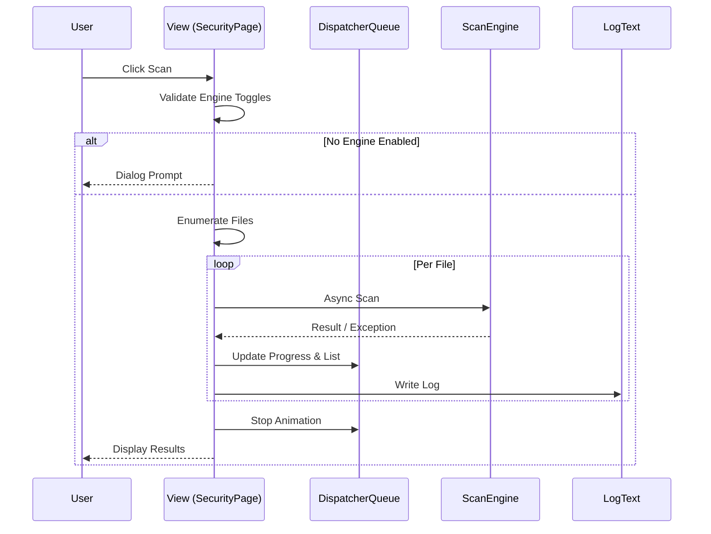

# Scan Logic {#ScanLogic}

This document describes the scanning logic implemented in the Xdows Security Scan Page (targeting developers).

## Feature Overview {#Feature}

Offers four virus-scanning modes: **Quick**, **Full**, **File**, and **Folder**, with support for **multi-engine parallel scanning** and **asynchronous streaming UI updates**.

| Input | Output |
|-------|--------|
| Scan Mode + User Path + Engine Toggles | Real-time progress, threat list, statistics, log entries |

## Sequence Overview {#Sequence}



## Engine Priority {#EnginePriority}

Async pseudo-code showing the invocation order:

1. SouXiao engine if enabled
2. Local engine (with Deep/Extra flags)
3. Generic cloud engine
4. Czk cloud engine (with API key)  
Return `null` means the file is considered safe.

## Enumeration Strategy {#Enumeration}

| Mode | Scope | Key Implementation |
|------|-------|--------------------|
| **Quick** | Critical system folders + executable extensions | `EnumerateQuickScanFiles()` |
| **Full**  | All local drives | `SafeEnumerateFiles()` skips inaccessible nodes |
| **File**  | Single file | `PickSingleFileAsync()` |
| **Folder**| Recursive directory | `SafeEnumerateFolder()` uses stack + try-catch |

## State Machine {#StateMachine}

| State | Trigger | UI Indication |
|-------|---------|---------------|
| `Idle` | Initial / Scan finished | Buttons enabled, radar stopped |
| `Running` | `StartScanAsync` | Buttons disabled, radar spinning |
| `Paused` | `OnPauseScanClick` | Radar paused, resume button shown |
| `Canceled` | `token.Cancel()` | Status shows "Scan canceled" |

## Exception & Cancellation {#Exception}

```csharp
catch (OperationCanceledException)
{
    StatusText.Text = "Scan canceled";
}
catch (Exception ex)
{
    LogText.AddNewLog(4, "Security - Failed", ex.Message);
}
```
> [!NOTE] Note
> 
> Exceptions affect only the **current file**; the queue continues.

## Performance & Threading {#Performance}

| Item | Strategy |
|------|----------|
| **Concurrency** | One `Task.Run(...)` per file, loop delays 1 ms |
| **UI Refresh** | `DispatcherQueue.TryEnqueue` ensures thread safety |
| **I/O Blocking** | `SafeEnumerate*` patterns pre-catch permission issues |

## Log Format {#Logging}

| Level | Module | Event | Details |
|-------|--------|-------|---------|
| 1 | Security - StartScan | Use LocalScan-DeepScan CloudScan |
| 1 | Security - ScanFile | C:\Windows\notepad.exe |
| 1 | Security - Find | MEMZUAC.Cloud.VirusFile |

## FAQ {#FAQ}

::: details How to add a new scan engine? {#AddEngine}
1. Register a toggle in settings.
2. Read the toggle inside `StartScanAsync`.
3. Append `if (useNewEngine) result = await NewScanAsync(path);` in the engine chain.
4. Update the "Engine Priority" section of this doc.
:::

::: details Why does the UI stay responsive during large scans? {#UIThread}
All heavy work runs on the **ThreadPool**; UI updates are marshaled via `DispatcherQueue`.
:::

::: details Need incremental scanning? {#Incremental}
Cache `LastScanTime` and compare with `LastWriteTime` during enumeration to skip unchanged files.
:::