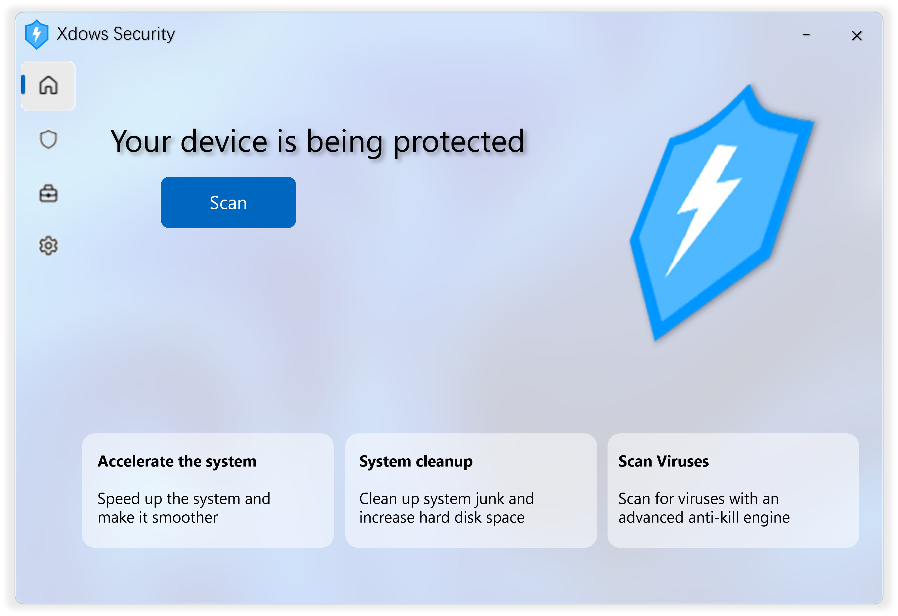

# Xdows-Security 4.1

Welcome to the concise documentation for Xdows-Security 4.1. This release continues the design of 4.0 with stability and compatibility improvements.

Quick links:

- [Get Started](get-started.md)
- [Changelog](update.md)

For full source and implementation details, refer to the `Xdows-Security` project folder in the repository.

## Implementation note

Xdows-Security 4.1 is a WinUI3 + C# desktop application (based on .NET 8 and Windows App SDK). The main project is located at `Xdows-Security/` in the repository; the rest of these docs follow that implementation.
