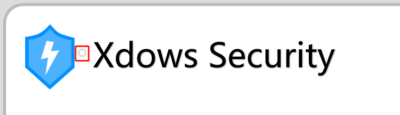

# Windows Client

## Introduction {#Info}
The `Windows` platform client was introduced starting from `Xdows Security 4.0 Beta-7`.

The client is built using the `ACF Browser Framework`.

::: details About the ACF Browser Framework
Original Author: Admenri

Note: Please pay attention to the relevant licenses when using this project.

Related Link: [Here (Chinese Page)](https://bbs.125.la/forum.php?mod=viewthread&tid=14845602)
:::

## Developer Tools {#DevTools}

In normal mode, the client disables the context menu and does not allow shortcuts such as `F12` or `Ctrl Shift J` to open the `Developer Tools`.

You can click the button next to the title bar icon (as shown below). After clicking, it may take a few seconds for the `Developer Tools` to open.



> [!IMPORTANT] Can't find this button?
> If your color mode is set to `Dark Mode`
>
> This button will be hidden. Please switch to `Light Mode` to continue.

## Client Communication {#Communication}

In the browser environment of the `client`, you can communicate with it through the `Client` class.

You can use `postMessage` to execute client interfaces. The usage is as follows:

```js
if (top.getBrowserType() == 'Client'){
    Client.postMessage(
        "FunctionName",
        "Parameter1",
        "Parameter2",
        "Parameter3",
        "..."
    );
};
```

### ChangeTheme {#ChangeTheme}

This function is used to change the client window theme (related colors). Example:

```js
if (top.getBrowserType() == 'Client'){
    Client.postMessage(
        "ChangeTheme",
        "Parameter1", // --Background-color variable value
        "Parameter2", // --Text-color variable value
        "Parameter3", // --Theme-color variable value
        "Parameter4", // --Theme-Background-color variable value
        "Parameter5"  // light or dark
    );
};
```