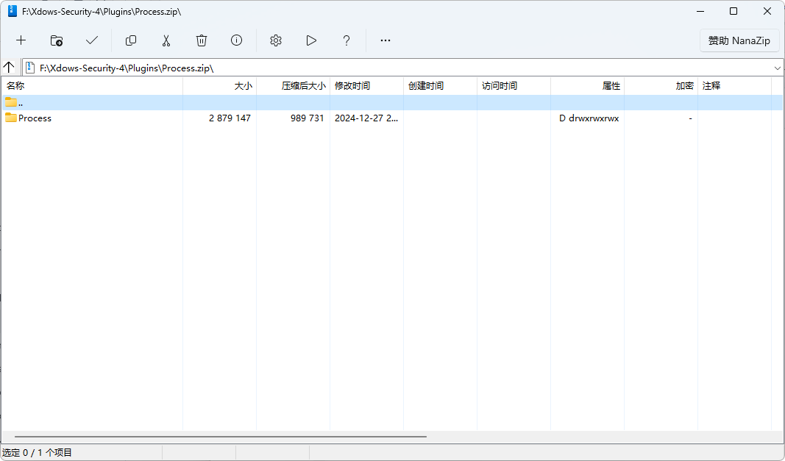

# Creating Plugin Packages

## Compression Software

In theory, you can use almost any software that supports ZIP compression.

However, it is recommended to use the open-source software `7-Zip` because of its efficient compression algorithm and wide compatibility.

This article uses `NanaZip`, which is based on `7-Zip`.

Other software may have different interfaces, but the steps are generally similar.

## Preparing Plugin Content

Before compressing, ensure that the plugin directory structure is correct. A standard plugin directory structure is as follows:

```
PluginName/
├── Data/
│   └── ...
└── Files/
    ├── Main.dll
    └── ...
```

Make sure the `Main.dll` file is located in the `Files` folder, and all necessary data files are stored in the `Data` folder.

## Compressing the Plugin Directory

1. Right-click on the plugin directory and select `Add to archive`.

2. In the pop-up window, choose the following options:

   - Compression format: zip
   - Compression level: Level 1 (fast compression, suitable for plugin packages)

   

   Below are example screenshots for other compression software:

   ::: details Windows Explorer
      
   :::
   ::: details WinRAR
      
   :::

3. Confirm the options and click `OK` to start compressing.

## Verifying the Compression Result

After compression, check if the generated ZIP file has the following directory structure:

```
Plugin.zip
├── PluginName/
│   ├── Data/
│   │   └── ...
│   └── Files/
│       ├── Main.dll
│       └── ...
```

You can verify this by extracting the file and checking its contents.

## Multi-Plugin Packages

Simply select multiple plugins and compress them together. The result should look like this:

```
Plugin.zip
├── PluginName1/
│   ├── Data/
│   │   └── ...
│   └── Files/
│       ├── Main.dll
│       └── ...
├── PluginName2/
│   ├── Data/
│   │   └── ...
│   └── Files/
│       ├── Main.dll
│       └── ...
└── ...
```

## Final Example

Below is a screenshot of the compressed package content using the Process plugin as an example:



## Common Issues

1. Incorrect file structure after compression
   - Check if the initial plugin directory structure meets the requirements.
   - Ensure the correct options were selected during compression.

2. ZIP file not recognized
   - Ensure the ZIP format was used.

3. Compression level selection
   - Level 1 is the recommended compression level, balancing speed and compression ratio.

4. How to import the plugin package
   - Use `Xdows Tools` - `AddPlugins` to import the plugin package.