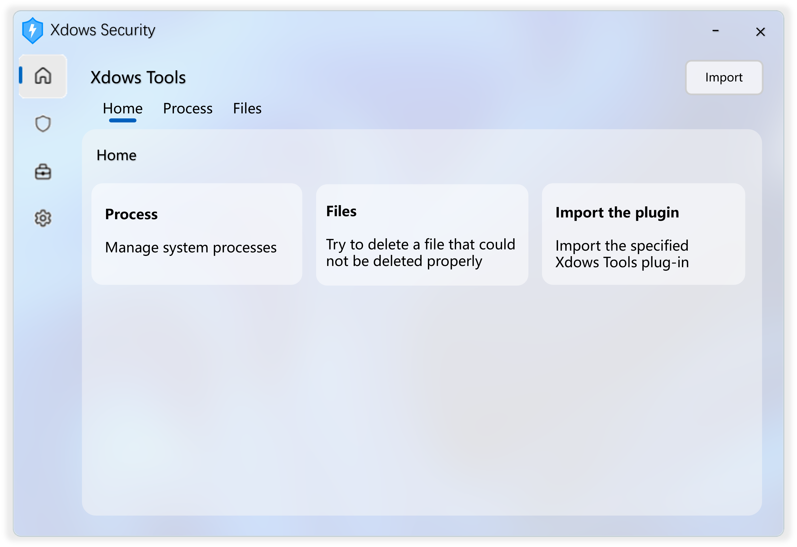

# Xdows Tools

(Image for reference only)

## Introduction

Xdows Tools is a built-in toolkit of Xdows Security.

Compared to version 3.0, Xdows Tools in Xdows Security 4.0 features a redesigned UI and supports plugin imports.

## Plugins

[See here](./Plugins/get-started.md)
