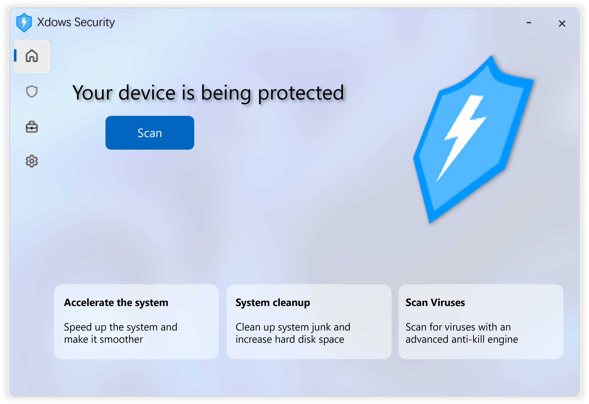

# Getting Started

(Image for reference only)

Take a look at the next-generation Xdows Security 4.0

## Introduction {#Info}

Xdows Security is an antivirus software designed to defend against potential threats and detect virus threats.

## Download {#Download}

You can now download the beta version.

Please read `README.txt` before installation.

The beta version is for testing purposes only, use at your own risk.

<Linkcard url="/Setup.zip" title="Download Xdows Security Beta" description="Current public beta version: 4.00-Beta5" logo="/logo.svg"/>

>[!NOTE] Want to get the latest source build?
>
>Join the [TG Build Channel](https://t.me/xdowssecurity) to get it (Beta versions are not guaranteed to be stable).
>

## Progress {#Progress}

 - [x] Project established
 - [x] Antivirus engine
 - [x] UI creation
 - [x] Connect UI and functionality
 - [x] Release internal beta
 - [x] Release public beta
 - [ ] Optimize and add features
 - [ ] Release official version

## Kernel {#Kernel}

Both Xdows Security 3.0 and 4.0 build their UI based on web technologies, but their interaction with the UI differs.

 - Version 3.0 simply loads web pages in a browser, and the kernel captures JavaScript operations on the web pages to achieve its purpose. Besides WebUI, there are other components that cannot be customized.

 - Version 4.0 truly allows data exchange between the browser and the kernel. It only has WebUI, greatly enhancing customizability. Additionally, the UI has a certain degree of cross-platform compatibility.
