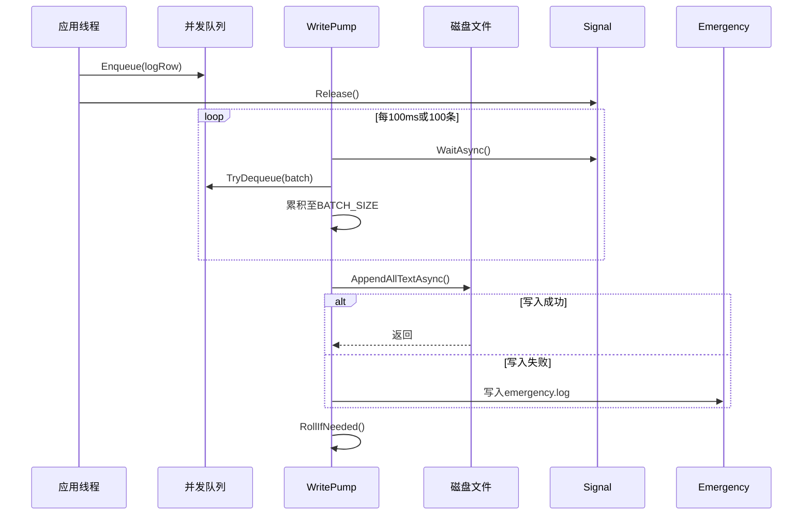

# 日志系统 {#log-system}

本文描述了 Xdows Security 中的日志系统（此文档面向开发人员）

## 概述 {#overview}

Xdows Security 的日志系统是一个为高性能桌面应用设计的异步日志框架，采用**双缓冲架构**（热缓存 + 持久化队列）和**批量写入**策略，确保在极低的性能开销下实现实时日志记录与持久化。系统针对 WinUI 3 的 UI 线程特性进行了特殊优化，支持动态日志级别和自动归档清理。

## 核心组件详解 {#core-components}

### 双缓冲存储模型 {#dual-buffer}

#### 热缓存（Hot Cache）
```csharp
private static readonly StringBuilder _hotCache = new();
private static int _hotLines;
```
- **作用**：驻留最近日志于内存，供 UI 实时显示
- **容量限制**：
  - 最大行数：`HOT_MAX_LINES = 500`
  - 最大字节：`HOT_MAX_BYTES = 80_000` (约80KB)
- **淘汰策略**：FIFO，头部截断至首个换行符

#### 持久化队列（Pending Queue）
```csharp
private static readonly ConcurrentQueue<LogRow> _pending = new();
private static readonly SemaphoreSlim _signal = new(0, int.MaxValue);
```
- **线程安全**：使用 `ConcurrentQueue` 支持多生产者并发写入
- **无界队列**：理论上受内存限制，实际受写入速度制约
- **信号量驱动**：每次入队释放信号量，唤醒后台写入线程

### 日志数据结构 {#log-data-structure}

```csharp
private record LogRow
{
    public DateTime Time;
    public int Level;
    public string Source = "";
    public string Text = "";
}
```

**格式化输出**：
```
[2024-01-15 14:30:25][INFO][Protection][ThreadId]: 日志内容
```

**Level 映射**：
```csharp
0 → DEBUG | 1 → INFO | 2 → WARN | 3 → ERROR | 4 → FATAL
```

### 后台写入泵（Write Pump）{#write-pump}



**关键特性**：
- **批量处理**：每批次最多 `BATCH_SIZE = 100` 条
- **异步IO**：使用 `File.AppendAllTextAsync` 避免阻塞
- **异常降级**：主路径失败时写入 `emergency.log`
- **自动轮转**：每日新文件，7天后自动清理

## 并发模型 {#concurrency-model}

### 线程安全策略 {#thread-safety}

| 组件 | 同步机制 | 说明 |
|------|----------|------|
| `_pending` 队列 | `ConcurrentQueue` (无锁) | 支持多线程并发入队 |
| `_hotCache` | `lock` 语句 | 保护 StringBuilder 非线程安全操作 |
| `_signal` | `SemaphoreSlim` | 异步信号通知，支持 await |
| `TextChanged` 事件 | 事件节流 | 100ms 防抖，避免 UI 线程过载 |

### 写入流程的并发控制 {#concurrency-control}

```csharp
// 生产者（任意线程）
public static void AddNewLog(int level, string source, string info)
{
    var row = new LogRow { ... };
    _pending.Enqueue(row);          // 线程安全
    _signal.Release();              // 唤醒消费者
    AppendToHotCache(row);          // 内部加锁
}

// 消费者（后台线程）
private static async Task WritePump()
{
    await _signal.WaitAsync();      // 异步等待
    while (_pending.TryDequeue(...)) // 批量消费
    // ...
}
```

## 性能优化 {#performance-optimization}

### UI 事件节流 {#ui-throttling}

```csharp
private static void RaiseChangedThrottled()
{
    if (Xdows_Security.MainWindow.NowPage != "Home") return; // 页面过滤
    
    _throttleTimer?.Dispose();
    _throttleTimer = new Timer(_ => TextChanged?.Invoke(...), null, 100, Timeout.Infinite);
}
```

**优化点**：
- **页面感知**：仅在 Home 页面触发事件
- **防抖控制**：100ms 延迟，合并高频更新
- **定时器复用**：避免频繁创建销毁

### 内存管理 {#memory-management}

```csharp
private static void TrimHotHead()
{
    int cut = _hotCache.ToString().IndexOf('\n') + 1;
    _hotCache.Remove(0, cut); // O(n) 但 n=500 行内
    _hotLines--;
}
```

**权衡**：StringBuilder 的 `Remove` 操作是 O(n)，但因容量限制在 500 行内，开销可接受。

### 零分配设计 {#zero-allocation}

- `LogRow` 使用 `record struct`（隐式）避免引用类型开销
- `LevelToText` 使用 `switch` 表达式而非字典查找
- 批量写入时预分配 `List<LogRow>(BATCH_SIZE)`

## 使用示例 {#usage-examples}

### 基础日志记录 {#basic-logging}

```csharp
// 记录不同级别日志
LogText.AddNewLog((int)LogLevel.INFO, "Scanner", "扫描开始");
LogText.AddNewLog((int)LogLevel.WARN, "Protection", "可疑行为 detected");
LogText.AddNewLog((int)LogLevel.ERROR, "Updater", "更新失败: 网络超时");

// 在 UI 中绑定日志
LogText.TextChanged += (s, e) => 
{
    myTextBox.Text = LogText.Text; // 获取完整热缓存
};
```

### 与保护模块集成 {#integration-with-protection}

```csharp
public static InterceptCallBack interceptCallBack = (bool isSucceed, string path) =>
{
    LogText.AddNewLog(2, "Protection", isSucceed
        ? $"InterceptProcess：{Path.GetFileName(path)}"
        : $"Cannot InterceptProcess：{Path.GetFileName(path)}");
    
    // UI 线程调度
    App.MainWindow?.DispatcherQueue?.TryEnqueue(() =>
    {
        InterceptWindow.ShowOrActivate(path);
    });
};
```

## 配置参数 {#configuration}

在代码中通过常量配置：

| 参数 | 值 | 说明 |
|------|----|------|
| `HOT_MAX_LINES` | 500 | 热缓存最大行数 |
| `HOT_MAX_BYTES` | 80,000 | 热缓存最大字节数（约80KB） |
| `BATCH_SIZE` | 100 | 批量写入大小 |
| `RetainAge` | 7天 | 日志文件保留时长 |

**修改建议**：
- 增大 `HOT_MAX_LINES` 可提升 UI 回溯能力，但增加内存占用
- 减小 `BATCH_SIZE` 可降低延迟，但增加磁盘 I/O 次数

## 异常处理 {#exception-handling}

### 多层防御策略 {#defense-strategy}

1. **应用崩溃捕获**
```csharp
AppDomain.CurrentDomain.UnhandledException += (_, e) =>
    AddNewLog((int)LogLevel.FATAL, "Unhandled", e.ExceptionObject.ToString()!);
```

2. **写入失败降级**
```csharp
catch
{
    var emergency = Path.Combine(BaseFolder, "emergency.log");
    await File.AppendAllTextAsync(emergency, ...);
}
```

3. **目录预创建**
```csharp
Directory.CreateDirectory(BaseFolder); // 静态构造函数中
```

## 最佳实践 {#best-practices}

### 推荐做法 {#recommendations}

1. **日志级别选择**
   - `DEBUG`：仅在开发模式记录详细调试信息
   - `INFO`：关键业务流程节点
   - `WARN`：非致命异常或可疑行为
   - `ERROR`：功能失败但应用继续运行
   - `FATAL`：需要立即终止的致命错误

2. **Source 命名规范**
   - 使用类名或模块名（如 `"Protection"`, `"Scanner"`）
   - 避免使用动态值，便于日志分类过滤

3. **高频日志优化**
   - 批量聚合后再记录（如扫描时每100个文件记录一次）

### 避免事项 {#things-to-avoid}

- **不要在日志回调中调用 `AddNewLog`**：会导致递归死锁
- **避免在 `TextChanged` 中执行耗时操作**：会阻塞 UI 线程
- **不要修改 `BaseFolder` 路径**：可能影响日志清理逻辑

## 扩展点 {#extension-points}

### 自定义日志输出器 {#custom-output}

可通过修改 `WritePump` 添加多种输出目标：

```csharp
// 示例：添加 syslog 支持
private static async Task WritePump()
{
    // ... 原有逻辑
    await SendToSyslog(batch); // 新增
}
```

### 动态配置 {#dynamic-configuration}

当前配置为编译时常量，可改为读取 `appsettings.json`：

```csharp
// 在静态构造函数中加载
var config = JsonSerializer.Deserialize<LogConfig>(
    File.ReadAllText(Path.Combine(AppContext.BaseDirectory, "log.json"))
);
```

## 性能指标 {#performance-metrics}

- **写入延迟**：约 0-100ms（受节流器影响）
- **吞吐量**：> 10,000 条/秒（批量模式下）
- **内存占用**：热缓存稳定 < 100KB
- **CPU 开销**：近似无锁，对业务线程影响 < 1%

## 日志文件结构 {#log-file-structure}

```
%LocalAppData%\Xdows-Security\
├── logs-2024-01-15.txt   # 主日志文件
├── logs-2024-01-14.txt   # 历史日志
└── emergency.log         # 异常降级日志
```

**文件格式**：
```text
[2024-01-15 14:30:25][INFO][Protection][1]: ProcessProtection enabled
[2024-01-15 14:30:26][WARN][Scanner][5]: Suspicious file: test.exe
```

每行记录包含 UTC 时间戳、级别、来源、线程ID和消息内容，便于 `grep` 等工具分析。