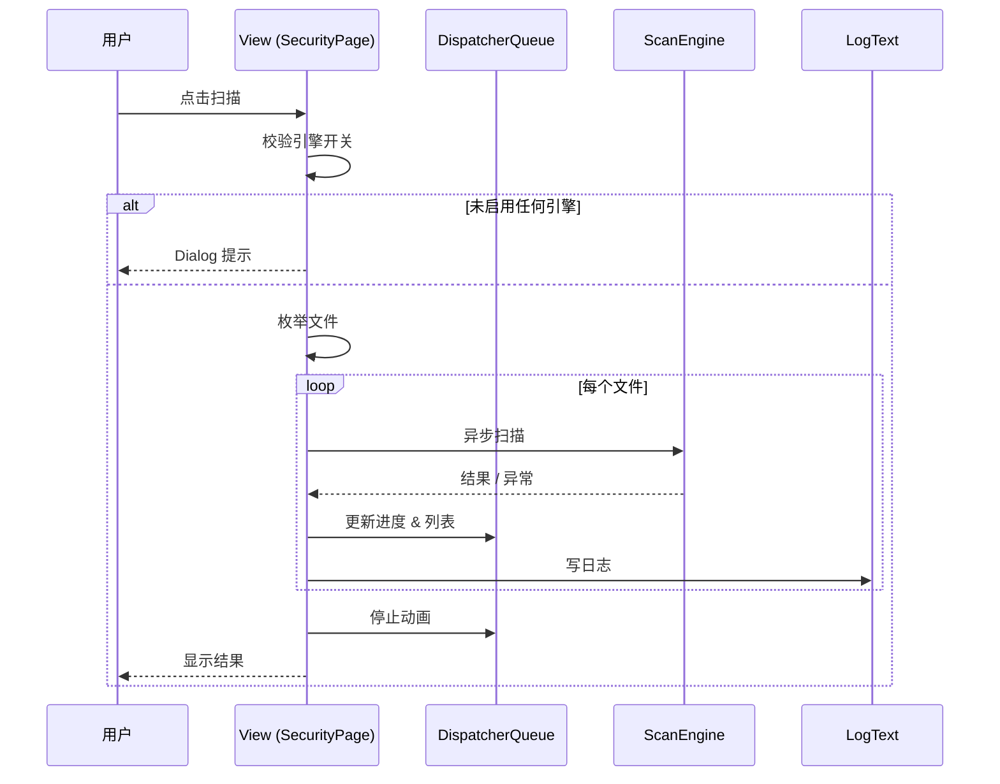

# 扫描逻辑 {#ScanLogic}

本文描述了 Xdows Security 扫描页面的扫描逻辑（此文档面向开发人员）

## 功能定位 {#Feature}

提供「快速 / 全盘 / 文件 / 文件夹」四种病毒扫描模式，支持**多引擎并行**与**异步流式 UI 更新**。

| 输入 | 输出 |
|---|---|
| 扫描模式 + 用户路径 + 引擎开关 | 实时进度、威胁列表、统计信息、日志文件 |

## 时序概览 {#Sequence}



## 引擎优先级 {#EnginePriority}

```ts
// 伪代码，仅表达顺序
async function scanFile(path: string): Promise<string | null> {
  if (useSouXiao)        return await souXiaoScan(path);
  if (useLocal)          return await localScan(path, deep, extra);
  if (useCloud)          return await cloudScan(path);
  if (useCzkCloud)       return await czkCloudScan(path, apiKey);
  return null;                                       // 安全
}
```

## 枚举策略 {#Enumeration}

| 模式 | 范围 | 关键实现 |
|---|---|---|
| **Quick** | 系统关键目录 + 可执行扩展名 | `EnumerateQuickScanFiles()` |
| **Full**  | 所有本地磁盘 | `SafeEnumerateFiles()` 跳过无权限节点 |
| **File**  | 单文件 | `PickSingleFileAsync()` |
| **Folder**| 递归目录 | `SafeEnumerateFolder()` 栈 + try-catch |

## 状态机 {#StateMachine}

| 状态 | 触发动作 | UI 表现 |
|---|---|---|
| `Idle` | 初始 / 扫描结束 | 按钮可用，雷达停止 |
| `Running` | `StartScanAsync` | 按钮禁用，雷达转动 |
| `Paused` | `OnPauseScanClick` | 雷达暂停，出现继续按钮 |
| `Canceled` | `token.Cancel()` | 提示“扫描已取消” |

## 异常与取消 {#Exception}

```csharp
catch (OperationCanceledException)
{
    StatusText.Text = "扫描已取消";
}
catch (Exception ex)
{
    LogText.AddNewLog(4, "Security - Failed", ex.Message);
}
```
> [!NOTE] 笔记
> 
> 所有异常仅影响**当前文件**，不会中断整个队列。

## 性能与线程 {#Performance}

| 项 | 策略 |
|---|---|
| **并发度** | 每文件 `Task.Run(...)` 不等待，循环延迟 1 ms |
| **UI 刷新** | `DispatcherQueue.TryEnqueue` 保证线程安全 |
| **I/O 阻塞** | 使用 `SafeEnumerate*` 提前捕获权限异常 |

## 日志格式 {#Logging}

|级别 | 模块 | 事件 | 详情|
|---|---|---|---|
|1    | Security - StartScan | Use LocalScan-DeepScan CloudScan|
|1    | Security - ScanFile  | C:\Windows\notepad.exe|
|1    | Security - Find      | MEMZUAC.Cloud.VirusFile|

## FAQ {#FAQ}

::: details 如何新增扫描引擎？ {#AddEngine}
1. 在设置中注册开关。
2. 在 `StartScanAsync` 读取开关。
3. 在引擎调用链追加 `if (useNewEngine) result = await NewScanAsync(path);`。
4. 更新本文档「引擎优先级」段落。
:::

::: details 为什么扫描大量文件时 UI 不卡？ {#UIThread}
所有耗时代码运行在 **ThreadPool**，UI 更新通过 `DispatcherQueue` 异步投递。
:::

::: details 需要增量扫描？ {#Incremental}
可缓存 `LastScanTime` 与文件 `LastWriteTime` 进行比对，在枚举阶段过滤。
:::
