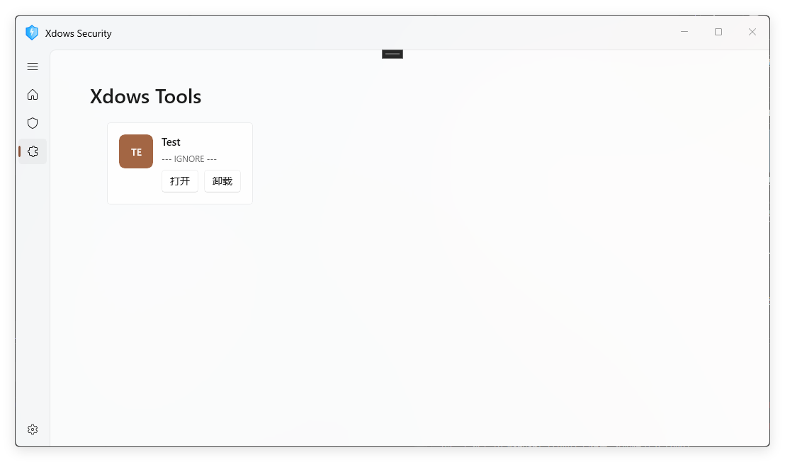

# 插件系统

## 简介

自 Xdows Security 4.1 Beta-3 后 `Mint` 为 Xdows Security 引入了全新的插件系统

新版插件系统使用 `WinUI3` 和 `C#`，基于 `.NET` 平台

## 编写你的第一个插件！

### 创建项目

1. 新建一个 `WinUI3 不打包 类库` 项目，名为 `PluginFramework`
> [!TIP] 如果不是 `PluginFramework`
> 
> 插件加载器只会加载文件名为 `PluginFramework.dll` 的文件
> 所以如果不是 `PluginFramework` 的话需要在生成之后改名
2. 在新建的项目中新建 `Plugin.cs`
3. 键入下面的 `代码文件`
::: details 代码文件
```csharp
using Microsoft.UI.Xaml.Controls;

namespace PluginFramework
{
    public partial class Plugin
    {
        public virtual void Load()
        {
            // Loading logic for the plugin
        }

        public virtual void Initialize()
        {

        }

        public virtual Page Entry()
        {
            Initialize();
            Page page = new();
            Grid grid = new()
            {
                DataContext = new TextBlock
                {
                    Text = "Hello from Plugin Framework!"
                }
            };
            page.Content = grid;

            return page;
        }

        public virtual void Unload()
        {
            // Unloading logic for the plugin
        }

        public virtual void Exit()
        {
            // Exit logic for the plugin
        }

    }
}
```
:::
4. 大功告成！

### 插件加载

生成项目，如果一切正常的话你会发现在生成目录会出现像这样的目录结构

```
生成位置
│  Microsoft.Web.WebView2.Core.dll
│  Microsoft.Web.WebView2.Core.Projection.dll
│  PluginFramework.deps.json
│  PluginFramework.dll
│  PluginFramework.pdb
│  PluginFramework.pri
│
└─PluginFramework
        PageBase.xaml
        PageBase.xbf

```
接下来，转到 Xdows Security 根目录，进入 `Plugin` (不是 `Plugins`，如果没有请新建)

在里面新建一个文件夹，名称随意（只要不是很奇怪就行？）

在里面复制你插件的文件，然后新建 `Information.json`，内容如下：

::: details 代码文件
```json
{
    "Name":"Test",
    "NameSpace":"PluginFramework",
    "EntryAddress":"PluginFramework.Plugin",
    "EntryFunction":"Entry",
    "Description":"--- IGNORE ---"
}
```
:::

完成之后的目录结构像这样

```
Plugin
└─你的目录名称
    │  Information.json
    │  Microsoft.Web.WebView2.Core.dll
    │  Microsoft.Web.WebView2.Core.Projection.dll
    │  PluginFramework.deps.json
    │  PluginFramework.dll
    │  PluginFramework.pdb
    │  PluginFramework.pri
    │
    └─PluginFramework
            PageBase.xaml
            PageBase.xbf
```

接下来启动 Xdows Security，你将看到你的插件出现在 Xdows Security 中!



### 清理步骤

现在你应该可以正常加载插件了，但是还不够所谓的“完美”，因为你可能会发现你虽然没用 WebView2，但是输出目录却有相关文件

- Microsoft.Web.WebView2.Core.dll
- Microsoft.Web.WebView2.Core.Projection.dll

如果你没有用到，可以直接删除

但是每次生成它都会重新出现

我们可以修改配置文件来解决这个问题

``` xml{14-17}
<Project Sdk="Microsoft.NET.Sdk">
  <PropertyGroup>
    <TargetFramework>net10.0-windows10.0.19041.0</TargetFramework>
    <TargetPlatformMinVersion>10.0.17763.0</TargetPlatformMinVersion>
    <RootNamespace>PluginFramework</RootNamespace>
    <RuntimeIdentifiers>win-x86;win-x64;win-arm64</RuntimeIdentifiers>
    <UseWinUI>true</UseWinUI>
    <WinUISDKReferences>false</WinUISDKReferences>
  </PropertyGroup>
  <ItemGroup>
    <PackageReference Include="Microsoft.Windows.SDK.BuildTools" Version="10.0.26100.7175" />
    <PackageReference Include="Microsoft.WindowsAppSDK" Version="1.8.251106002" />
  </ItemGroup>
	<Target Name="RemoveWebView2Files" AfterTargets="AfterBuild"> <!-- [!code ++] -->
		<Delete Files="$(OutDir)Microsoft.Web.WebView2.Core.dll" /> <!-- [!code ++] -->
		<Delete Files="$(OutDir)Microsoft.Web.WebView2.Core.Projection.dll" /> <!-- [!code ++] -->
	</Target><!-- [!code ++] -->
</Project>
```
生成后，目录结构应不再包含这两个文件
```
生成位置
│  PluginFramework.deps.json
│  PluginFramework.dll
│  PluginFramework.pdb
│  PluginFramework.pri
│
└─PluginFramework
        PageBase.xaml
        PageBase.xbf

```