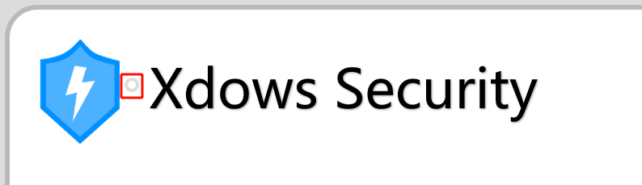

# Windows 客户端

## 简介 {#Info}
从 `Xdows Security 4.0 Beta-7` 开始添加了 `Windows` 平台的客户端

客户端使用 `ACF浏览器框架` 制作

::: details 关于 ACF浏览器框架
源作者：Admenri

相关说明：在使用此项目时请注意相关协议

相关链接：[这里](https://bbs.125.la/forum.php?mod=viewthread&tid=14845602)
:::

## 开发者工具 {#DevTools}

在正常状态下，客户端禁止弹出右键菜单，也不能使用快捷键如 `F12` `Ctrl Shift J` 来打开 `开发者工具`

你可以点击标题栏图标右边的按钮（如下图），点击后可能需要等待几秒才会打开 `开发者工具`

