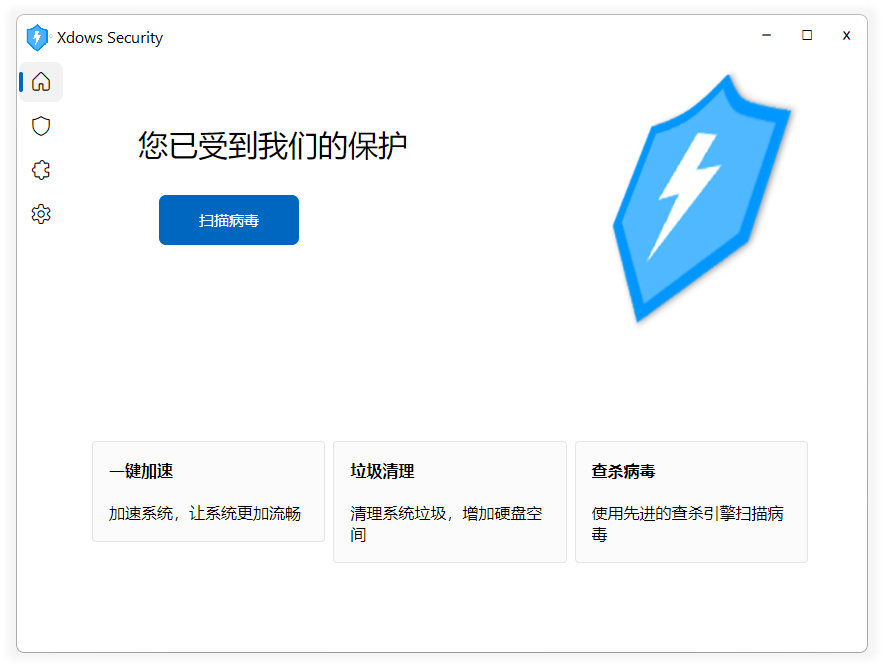

# Windows 客户端



## 简介 {#Info}
从 `Xdows Security 4.0 Beta-7` 开始添加了 `Windows` 平台的客户端

客户端使用 `ACF浏览器框架` 制作

::: details 关于 ACF浏览器框架
源作者：Admenri

相关说明：在使用此项目时请注意相关协议

相关链接：[这里](https://bbs.125.la/forum.php?mod=viewthread&tid=14845602)
:::

## 开发者工具 {#DevTools}

在正常状态下，客户端禁止弹出右键菜单，也不能使用快捷键如 `F12` `Ctrl Shift J` 来打开 `开发者工具`

你可以点击标题栏图标右边的按钮（如下图），点击后可能需要等待几秒才会打开 `开发者工具`


> [!IMPORTANT] 找不到这个按钮？
> 如果你的颜色模式为 `深色模式`
> 
> 这个按钮将会被隐藏，请切换为 `浅色模式` 以继续

## 客户端通信 {#Communication}

在 `客户端` 的浏览器环境中可以通过 `Client` 类与其通信

其中可以通过 `postMessage` 让执行客户端接口，相关调用方式如下：

```js
if (top.getBrowserType() == 'Client'){
	Client.postMessage(
		"函数名",
		"参数1",
        "参数2",
        "参数3",
        "..."
	);
};
```

### ChangeTheme {#ChangeTheme}

此函数用于修改客户端窗口主题（相关颜色），相关示例：

```js
if (top.getBrowserType() == 'Client'){
	Client.postMessage(
		"ChangeTheme",
		"参数1",// --Background-color 变量内容
		"参数2",// --Text-color 变量内容
		"参数3",// --Theme-color 变量内容
		"参数4",// --Theme-Background-color 变量内容
		"参数5" // light 或 dark
	);
};
```