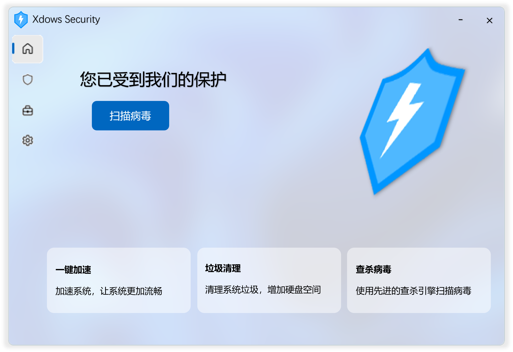
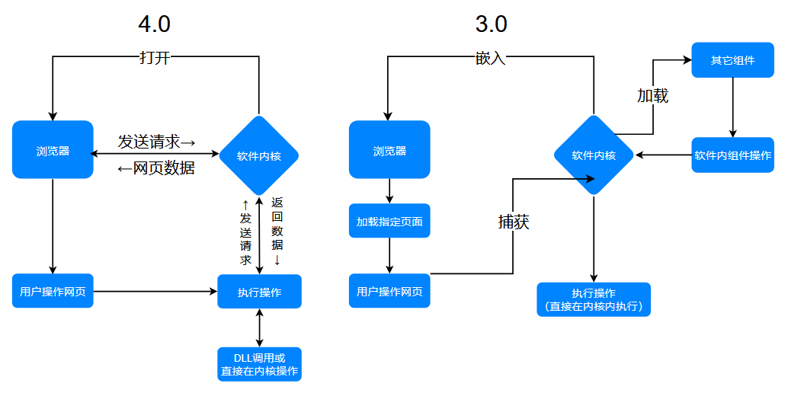

# 公告

::: danger 对于他人的嘲讽，我们再也忍无可忍
一个做云盘和 PE，与我们毫无关系的团队对我、西瓜杀毒、CZK等人及其相关软件/产品进行谩骂和嘲讽，

并且公然违反开源协议，盗用他人项目，甚至还能说出 “死了去葬墓 是不是也要把棺材的制作人也写上去” 这种毫无逻辑可言的话，

面对没有证据的贬低和职责，我们已经忍无可忍了！

在这里查看 [相关证据](https://xiguasystem.top/) 
:::

# 快速开始 {#GetStarted}

（图片仅供参考）

来看看下一代的全新 Xdows Security 4.0

## 简介 {#Info}

Xdows Security 是旨在防御潜在威胁与检测病毒威胁的杀毒软件。

## 下载 {#Download}

你现在可以下载测试版

请先看 `README.txt` 再安装

测试版仅供测试，后果自负

<Linkcard url="https://www.123865.com/s/1y1qVv-52LY" title="下载 Xdows Security Beta" description="本次公测版本：4.00-Beta7" logo="/logo.svg"/>

## 进度 {#Progress}

 - [x] 项目建立
 - [x] 杀毒引擎
 - [x] 制作 UI
 - [x] 连接 UI 和功能
 - [x] 发布内测版
 - [x] 发布公测版
 - [ ] 优化和补充功能
 - [ ] 发布正式版

## 内核 {#Kernel}

Xdows Security 的 3.0 和 4.0 都基于 Web 技术构建 UI ，但其与UI交互的方式有所不同

从中可以看到：

 - 3.0 版本只是让浏览器加载网页然后内核捕获网页的 js 操作达到目的，并且除了 WebUI 仍然有其它组件，这些组件不可自定义

 - 4.0 版本是真正的可以和浏览器互相发送数据，并且只有 WebUI，大大提高了可自定义性，同时UI还有一定的跨平台性
