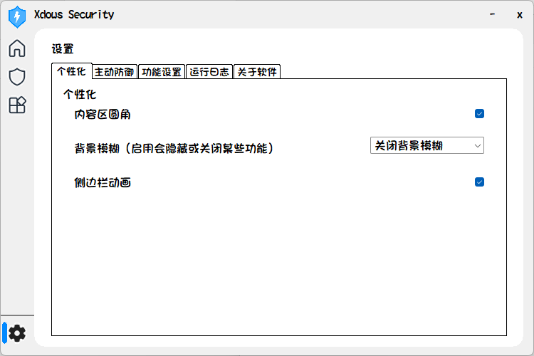
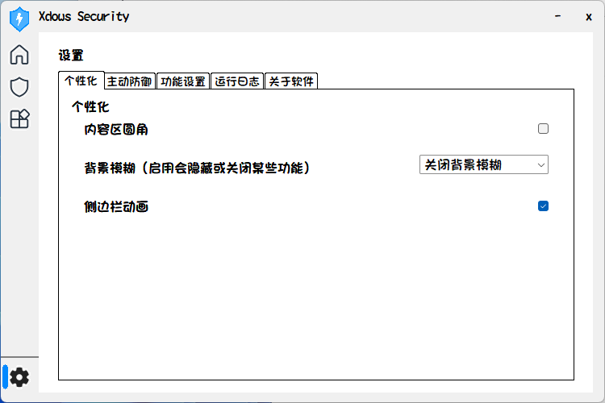
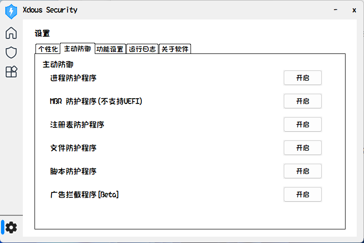
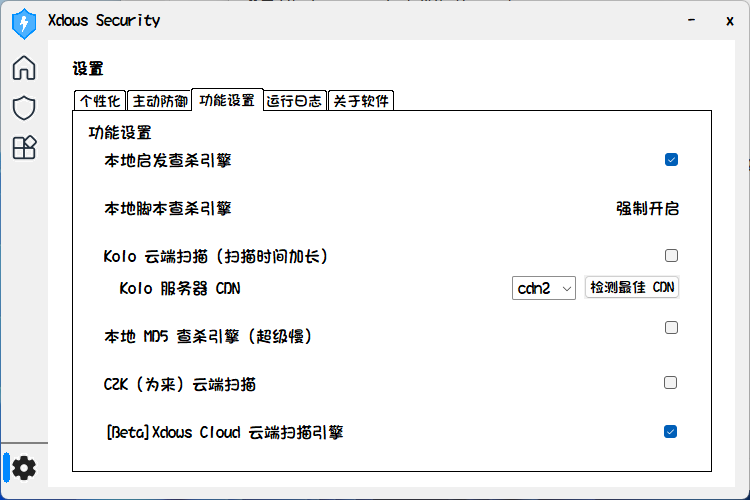
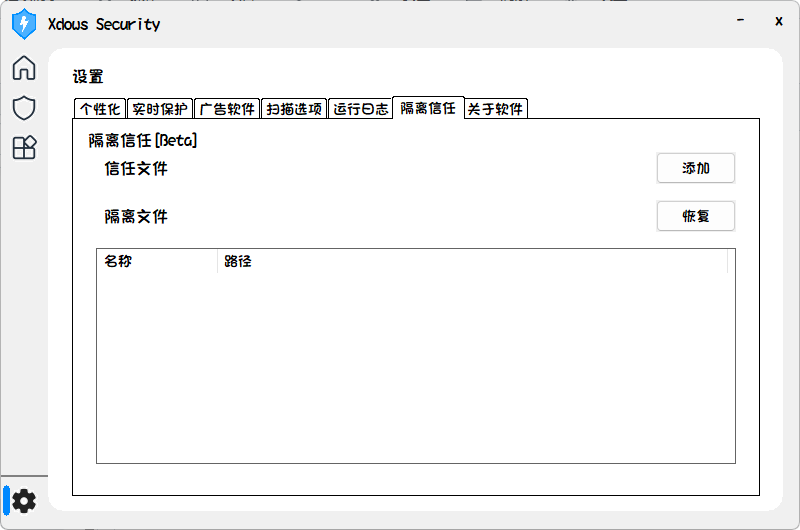

# 设置功能

> [!NOTE] 重要
> 这篇文章中的 *install* 代表软件安装目录

## 个性化

个性化可以对 Xdows Security 的 UI 进行设置。



### 基础

内容区圆角是默认开启的

关闭的样子如图所示


（内容区的四角）

背景模糊**只支持** Windows 11 系统，启用会隐藏窗口标题和关闭侧边栏动画

侧边栏动画是控制侧边栏蓝色条的动画

### 启动动画

启动动画位置

```txt
Install\Bin\Home
```

### 进阶

::: tip 提示
如果你运行着 Xdows Security Pro 并且想要更深度的定制，请联系作者

具体内容请查看[这里][Pro-Version]
:::

#### 定制 Html

Xdows Security UI 是基于 [Miniblink 内核][Miniblink] 构建的，所以你可以编辑相关文件来达到修改 UI 的效果。具体路径如下：

::: code-group

```txt[主页 Html]
Install\Bin\Home
```

```txt[杀毒 Html]
Install\Bin\Security
```

```txt[Xdows Tools Html]
Install\Bin\Xdows Tools
```

```txt[高级设置 Html<Badge type="warning" text="3.06 Beta" />]
Install\Bin\Settings\Advanced
```
:::

::: warning 警告
设置**不支持**定制，因为它不是基于 [Miniblink 内核][Miniblink] 构建的。
:::

::: tip 提示
如果你运行着 Xdows Security N ，因为纯组件的原因，无法进行定制

具体内容请查看[这里][N-Version]
:::

#### 定制启动动画<Badge type="tip" text="3.05" />


启动动画位置
```txt
Install\Bin\Startup
```

可以修改该位置的图片来修改启动图片<del>包括原神启动</del>

## 主动防御

这里用于开启 Xdows Security 的服务



## 功能设置

这里列出了 Xdows Security 支持的所有扫描引擎，你可以自由开关。（这是旧版本的截图，新版可能有改动）



::: tip 提示
如果你运行着 Xdows Security Pro 会有额外防护，具体内容请查看[这里][Pro]
:::

::: tip 提示
如果你运行着 Xdows Security 的旧版本，请注意某些引擎已经无法使用
:::

## 运行日志

如果 Xdows Security 崩溃了，这些日志可能对我们有帮助，你可以在 QQ 群反馈并带上日志文件，路径如下：

```txt
Install\Log\Run.txt
```

## 隔离信任<Badge type="warning" text="3.06 Beta" />

在之前的版本中，扫描到病毒都是**直接删除**的。现在，Xdows Security 将会先尝试隔离文件，如果失败再尝试删除文件



### 信任区

单击 `添加` 以修改信任区

如果文件已经在信任区，将会从信任区删除这个文件

### 隔离区

隔离区**不是**实时刷新的

切换”设置选择夹“将会刷新隔离区

单击 `恢复` 以从隔离区恢复文件

## 高级设置

里面是 Xdows Security 正在测试的功能<del>以及 IU Song Part 1</del>

::: tip 提示
3.06版本开始基于 [Miniblink 内核][Miniblink] 构建。
:::

## 关于软件

记录了组件作者、鸣谢列表等数据

点击右上方 `反馈` 按钮以反馈问题

::: tip 提示
在这感谢所有贡献了开源代码的开发者！
:::

[N-Version]:/Xdows-Security/version.html#N-版本
[Pro-Version]:/Xdows-Security/version.html#pro-版本
[Miniblink]:https://miniblink.net/
